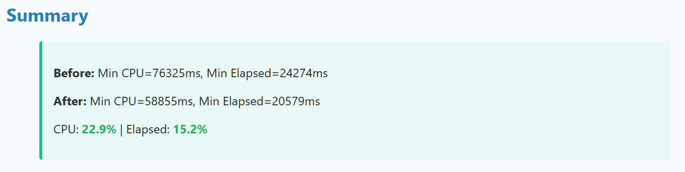
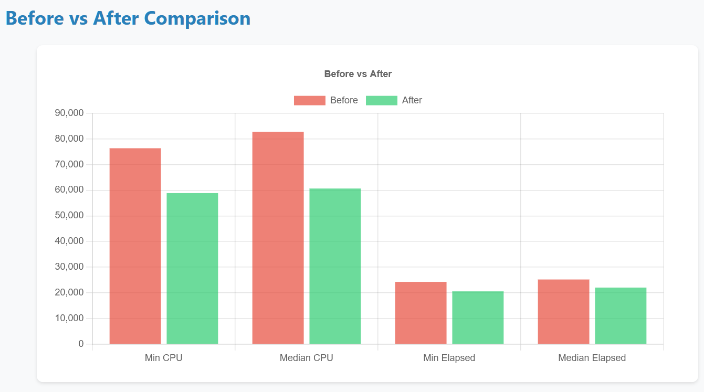

# Tedd.AutoSqlOptimizer

Works with MSSQL 2025 (and probably earlier versions).

**AI-driven automatic hypothesis generation and testing for SQL Server query optimization.**

Point it at a slow SQL Server command. The tool uses AI to inspect the underlying stored procedures and views, form optimization hypotheses, apply each one, benchmark it, verify result integrity via checksums, revert the change, and report which hypothesis won — all fully automated, zero manual intervention.





---

## How It Works

```
Slow SQL command
       |
       v
[1] Schema Discovery
    AI reads the stored procedure / view source,
    follows dependencies, identifies base tables
       |
       v
[2] Hypothesis Generation
    AI proposes N optimization strategies
    (indexes, columnstore, query rewrites, statistics, ...)
       |
       v
[3] For each hypothesis:
    a. Apply optimization SQL
    b. Warm up + measure timing (CPU ms / elapsed ms)
    c. Checksum base tables  ->  verify result correctness
    d. Revert optimization SQL
    e. Record outcome
       |
       v
[4] Report
    Markdown + HTML summary:
    best strategy, % improvement, all timings, integrity status
```

### Disclaimer and Warning

The operations, including checksum and reverting changes, is done by AI. AI is well known to fail or to weird things like deleting all data permanently.

<u>It is important that you understand this risk.</u>

Example: Recently I got help from AI to change a column. To do this it decided to create new table, copy over data, delete old table and rename new table in place. It did all of that perfectly, except the copy-data step failed. Table was lost, data gone.

So, whatever database you give it access to - just assume it will mess it up.
I'm not to be held liable for any damages caused by this source code.

### Key Safety Guarantee attempts

- **Checksums before and after** — row count + `CHECKSUM_AGG(BINARY_CHECKSUM(*))` on all touched base tables. If any checksum differs, the attempt is flagged as a data integrity failure.
- **Always reverts** — every hypothesis is rolled back after measurement. The database is left in its original state.
- **Cache flushed between runs** — `CHECKPOINT`, `DBCC DROPCLEANBUFFERS`, `DBCC FREEPROCCACHE` between each iteration to prevent warm-cache skew.
- **Statistics updated** — `UPDATE STATISTICS WITH FULLSCAN` applied after schema changes to ensure a fair comparison.

---

## Getting Started

### Prerequisites

- [.NET 10 SDK](https://dotnet.microsoft.com/download)
- SQL Server (2019+ recommended; requires `sysadmin` or equivalent for cache-clearing commands)
- An OpenAI API key (or compatible endpoint)

### 1. Clone

```bash
git clone https://github.com/tedd/Tedd.AutoSqlOptimizer.git
cd Tedd.AutoSqlOptimizer
```

### 2. Configure

Copy the template and fill in your credentials:

```bash
cp src/Tedd.AutoSqlOptimizer/appsettings.json \
   src/Tedd.AutoSqlOptimizer/appsettings.Development.json
```

Edit `appsettings.Development.json`:

```json
{
  "ConnectionString": "Server=YOUR_SERVER;Database=YOUR_DATABASE;User Id=YOUR_USER;Password=YOUR_PASSWORD;Encrypt=True;TrustServerCertificate=True;Connection Timeout=600;",
  "OpenAI": {
    "ApiKey": "sk-..."
  }
}
```

`appsettings.Development.json` is loaded on top of `appsettings.json` and is git-ignored — your secrets stay local.

**Alternative: environment variables**

```bash
export OPENAI_API_KEY=sk-...
```

Or place the key in `~/.openaikey` (plain text, no newline needed).

### 3. Add Init.sql (optional)

To give it a fair start, and not to mess with anything it shouldn't, I use a development server (Linux, Docker) and limit its CPU's to same as our Azure instance. I also restore the DB from scratch before every run.

```sql
USE master;
ALTER DATABASE [devdb-03]
    SET SINGLE_USER
    WITH ROLLBACK IMMEDIATE;

CHECKPOINT;

RESTORE DATABASE [devdb-03]
FROM DISK = '/var/opt/mssql/backup/devdb-01.bak'
WITH
    MOVE 'devdb-01'
        TO '/var/opt/mssql/data/devdb-03.mdf',
    MOVE 'devdb-01_log'
        TO '/var/opt/mssql/data/devdb-03_log.ldf',
    RECOVERY,
    REPLACE;

CHECKPOINT;

ALTER DATABASE [devdb-03]
    SET MULTI_USER;

CHECKPOINT;
```

### 4. Add Optimization Targets

Create a folder under `src/Tedd.AutoSqlOptimizer/Optimize/` named with a numeric prefix and a description:

```
Optimize/
├── init.sql            <- optional DB initialization / restore script
└── 001_MySlowProcedure/
    ├── AI_Input.txt    <- freetext description of the test (optional — see below)
    ├── 1_before.sql    <- SQL to benchmark (required, OR generated from AI_Input.txt)
    ├── 2_optimize.sql  <- optimization SQL  (omit for AI mode)
    ├── 3_after.sql     <- after SQL         (omit for AI mode; defaults to 1_before.sql if absent)
    └── 4_revert.sql    <- revert SQL        (omit for AI mode)
```

#### `AI_Input.txt` — freetext test description

`AI_Input.txt` is an optional plain-text file that can be placed in any optimization folder. It serves two purposes:

1. **Extra context for the AI optimizer.** When present it is injected into every schema-discovery and optimization prompt, giving the AI human-written domain knowledge (e.g. "this proc is called with millions of rows, PartyId is always filtered, the result is sorted by date").

2. **Generates missing SQL files on the fly.** If any of the four SQL files are absent, the AI uses `AI_Input.txt` to generate them before the benchmark run starts:
   - `1_before.sql` missing → AI generates the benchmark query from the description.
   - `3_after.sql` missing → defaults to `1_before.sql` (same query, different schema state).

The system works correctly with any combination of present/absent files as long as at least `1_before.sql` or `AI_Input.txt` is provided.

---

**AI mode** (recommended): provide only `1_before.sql` (and optionally `AI_Input.txt`). The tool discovers the schema and generates all optimization hypotheses automatically.

**Description-only mode**: provide only `AI_Input.txt`. The AI generates `1_before.sql` from the description, then runs in AI mode.

**Manual mode**: provide all four SQL files. The tool applies `2_optimize.sql`, benchmarks `3_after.sql`, then runs `4_revert.sql`. All files fully support multi-batch scripts using `GO` statement separators.

#### Example `1_before.sql`

```sql
EXEC [dbo].[usp_MySlowProcedure] @Param1 = 1
```

Or a plain query:

```sql
SELECT c.CustomerName, SUM(o.Amount) AS Total
FROM Orders o
JOIN Customers c ON c.Id = o.CustomerId
WHERE o.OrderDate >= '2024-01-01'
GROUP BY c.CustomerName
ORDER BY Total DESC
```

### 5. Run

```bash
cd src/Tedd.AutoSqlOptimizer
dotnet run
```

Optionally filter to a single optimization folder by passing part of its name:

```bash
dotnet run -- MySlowProcedure
```

---

## Configuration Reference

All settings live in `appsettings.json` (defaults) and can be overridden in `appsettings.Development.json` or via environment variables.

| Key | Default | Description |
|-----|---------|-------------|
| `ConnectionString` | *(placeholder)* | SQL Server connection string |
| `OpenAI:ApiKey` | `""` | OpenAI API key (or set `OPENAI_API_KEY` env var) |
| `OpenAI:Model` | `gpt-4o` | Model used for schema analysis and hypothesis generation |
| `BenchmarkIterations` | `5` | Number of timed iterations per hypothesis |
| `WarmUpIterations` | `3` | Warm-up iterations before timing begins |
| `AiOptimizationCount` | `10` | Number of hypotheses the AI generates per target |
| `AiMaxRetries` | `4` | Max retries if the AI generates invalid SQL |
| `TimingMetric` | `Lowest` | `Lowest` or `Average` — which timing value to use for comparison |
| `OptimizationsPath` | `Optimize` | Folder containing optimization targets |
| `OutputPath` | `Runs` | Folder where run results are written |
| `IntegrityCheckSkipPattern` | `^SYS_MON\.` | Regex — skip checksum for tables matching this pattern |
| `IncludePatterns` | `[]` | List of regexes — only run folders whose name matches at least one pattern (empty = run all) |
| `ExcludePatterns` | `[]` | List of regexes — skip folders whose name matches any pattern (empty = skip none) |
| `RunInitBeforeEachTest` | `false` | Run `init.sql` before every optimization folder instead of once at startup |
| `RunInitBeforeNextTestIfRevertFailed` | `false` | Run `init.sql` before the next test if the previous revert failed, to restore a clean DB state |

---

## Output

Each run creates a timestamped folder under `Runs/`:

```
Runs/
└── 2026-03-14 153000/
    ├── run.log                    <- full timestamped log
    ├── summary.html               <- live-updating summary across all targets
    ├── summary.md
    └── 001_MySlowProcedure/
        ├── AI_Input.txt           <- copied from source folder (if present)
        ├── 1_before.sql           <- captured/generated before SQL
        ├── 3_after.sql            <- captured after SQL (may equal 1_before.sql)
        ├── ai_opt_1/
        │   ├── description.txt    <- AI hypothesis description
        │   ├── ai_prompt.txt      <- the prompt sent to the AI
        │   ├── 2_optimize.sql     <- generated optimization SQL
        │   └── 4_revert.sql       <- generated revert SQL
        ├── ai_opt_2/ ...
        ├── ai_opt_combined/       <- combined best-of-all attempt (AI mode)
        ├── results.md             <- per-target report (Markdown)
        └── results.html           <- per-target report (HTML, open in browser)
```

The HTML report shows:

- Before baseline timing (CPU ms + elapsed ms)
- Each hypothesis: name, description, timing, improvement %, integrity status
- Best overall strategy highlighted

---

## Optional: Database Init Script

Place an `init.sql` in the `Optimize/` folder. It runs once before any benchmarks by default — useful for restoring a snapshot or seeding test data. Set `RunInitBeforeEachTest: true` to re-run it before every folder, or `RunInitBeforeNextTestIfRevertFailed: true` to re-run it only when a revert left the DB dirty:

```
Optimize/
├── init.sql          <- optional, runs first (or per-test — see config)
└── 001_MyTarget/
    └── 1_before.sql
```

If `init.sql` contains `RESTORE DATABASE`, the tool automatically connects to `master` for that step.

---

## Architecture

```
Program.cs               Entry point, configuration, logging
Services/
  BenchmarkRunner.cs     Orchestrates the full run lifecycle
  AiOptimizer.cs         Schema discovery, AI hypothesis loop, integrity checks
  SqlExecutor.cs         SQL execution, timing, cache clearing, checksums
  ReportGenerator.cs     Markdown and HTML report generation
Models/
  BenchmarkConfig.cs     Configuration model
  OptimizationFolder.cs  Loads and parses an optimization folder
  BenchmarkResult.cs     Timing measurements
  OptimizationSummary.cs Cross-folder run summary
  SqlTimingResult.cs     Single execution timing (CPU + elapsed ms)
```

---

## License

[PolyForm Noncommercial License 1.0.0](LICENSE.md)
